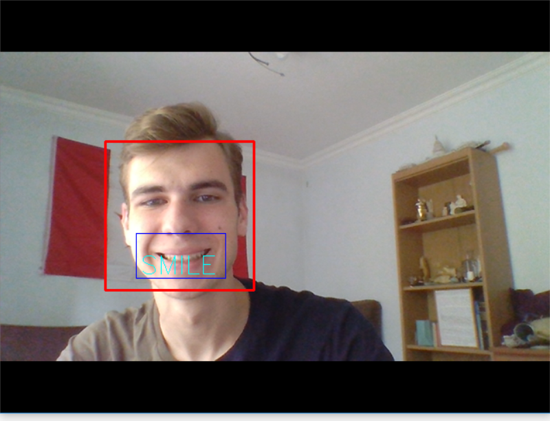

# SmileMore (Client)

Have you ever wondered how often you smile and how good it is for your health? Just install this app make this program think instead of you! 
## Prerequisites

Python 3+ needed and webcam

## Built With

* [OpenCV](https://opencv.org/) - Framework for computer vision
* [PyQT](https://www.qt.io/) - Cross-platform SDK for UI
* Passion for computer vision

## How to use? Easy

### Simple registration and main screen

### Just click start and become more productive

### Camera will be activing and then waiting for you to smile and so on, periodically

### Time of smile is stored on server

### Statistics provided (soon)
